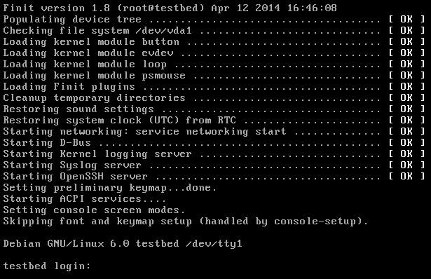
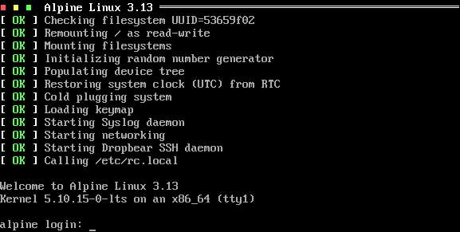
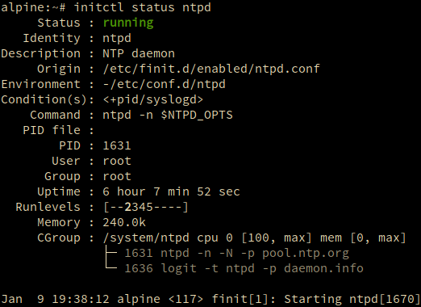

# What is Finit?

---

## Background

:::::::::::::: {.columns align=center totalwidth=11em}
::: {.column width="50%"}

- Alternative init, c.f., traditional UNIX System V init, or systemd
- Reverse engineered from the Asus EeePC *fastinit* by Claudio Matsuoka
- Finit v1 was very limited, idea was to limit then expensive fork+exec calls  
  → get to X quickly!

{ width=90% }

:::
::: {.column width="50%" align=bottom}


:::
::::::::::::::

::: notes

- Existed before systemd
- Has runlevels, but not like sysv init

:::

---

:::::::::::::: {.columns align=center totalwidth=11em}
::: {.column width="50%"}

## Evolution

- Start services in massive parallel
- Handle dependencies between services
- Monitor services, restart if they crash
- Built-in automatic fsck
- Built-in automatic modprobe
- Built-in automatic network bring-up

:::
::: {.column width="50%" align=bottom}
{ width=100% }
:::
::::::::::::::

::: notes


:::

---

## /etc/finit.conf

\footnotesize
```
task [S] /libexec/system/setup.sh  -- Bootstrap system

service [2345] foo -args           -- Foo service

service [2345] <pid/foo> bar -args -- Bar service
service [2345] <pid>bar> baz -args -- Baz service

tty [12345789] console
tty :1 [12345789] tty1
tty :2 [2345] tty2
tty :3 [2345] tty3

service [LVLS] <COND> log env:[-]/etc/default/daemon daemon ARGS -- Service daemon
^       ^      ^      ^   ^                          ^      ^       ^
|       |      |      |   |                          |      |        `---------- Optional description
|       |      |      |   |                          |       `------------------ Daemon arguments
|       |      |      |   |                           `------------------------- Path to daemon
|       |      |      |    `---------------------------------------------------- Optional env. file
|       |      |       `-------------------------------------------------------- Redirect output to log
|       |       `--------------------------------------------------------------- Optional conditions
|        `---------------------------------------------------------------------- Optional Runlevels
 `------------------------------------------------------------------------------ Monitored application
```
\normalsize

---

# Changes in v4

---

:::::::::::::: {.columns align=center totalwidth=11em}
::: {.column width="50%"}
## What's New?

- `job:id` → `name:id`
- **cgroups**
- Environment files for services, with dependency tracking
- tty's are now services, finally!
  - conditions & status
  - enable/disable & start/stop
- SysV init script support
- `pre:script` and `post:script` support for init and cleanup tasks
- Proper rescue mode with `sulogin(9)`
- Background network bring-up, of `/etc/network/interfaces`
:::
::: {.column width="50%" align=bottom}
## What's Removed?

- Built-in inetd support, instead use:
  - openbsd-inetd
  - BusyBox inetd
  - and iptables

- Fallback shell  
  → use new `tty` option flags instead

- Emergency shell  
  → replaced with rescue mode (next slide)

- `HOOK_SVC_START` and `HOOK_SVC_LOST`  
  → too fragile
:::
::::::::::::::

::: notes

- A lot
- Here we only list a few noteworthy features

:::

---

:::::::::::::: {.columns align=center totalwidth=11em}
::: {.column width="60%"}

## features

- Major updates to initctl tool (commands + output)
- Environment files with dependency tracking
- tty’s are finally standard services
  - conditions, enable/disable, start/stop, etc.
  - new `notty` flag for board bringup
  - new `rescue` flag starts `sulogin` for security
- SysV init script support
- pre-/post-script support for init and cleanup tasks
- Support for `/etc/network/interfaces`

:::
::: {.column width="40%" align=bottom}

{ width=100% }

:::
::::::::::::::

---

# initctl

---

## initctl changes

- service identity same as in .conf file: job:id → name:id

        name:foo
        :id

- greatly improved output from

        initctl status
        initctl status foo
		
- improved interaction with user defined conditions

- new commands

---

## new initctl commands

- Detailed status of services, with
- improved integration of service management, and 
- custom `usr/` conditions
- Also, spin-offs from the addition of cgroups support

```
initctl [status]               # Show status of all services (old)
initctl status foo             # Show status of service foo
initctl show foo               # show foo.conf
initctl edit [-c] foo          # edit (optionally create) foo.conf
initctl touch foo              # mark foo.conf as modified for reload
initctl cond [set,clear] bar   # user conditions, static & one-shot
initctl ps                     # tree view of known services with arguments
initctl top                    # top like view of services (cgroups)
initctl cgroup                 # cgroup view of services (limits)
```

---

# cgroups v2

:::::::::::::: {.columns align=center totalwidth=11em}
::: {.column width="40%"}

- New tooling to inspect resources:

        initctl ps
        initctl top
        initctl cgroup
- Tree view with ps subcommand

        root/
          |-- init/
          |    `-- finit
          |-- system/
          |    |-- ssh/
          |    |    `-- dropbear
          |    `-- Quagga/
          |         |-- ospfd
          |         `-- zebra
          `-- user/
               |-- sh
               `-- getty tty2
:::
::: {.column width="60%" align=bottom}

- Default groups:
  - init (100)
  - system (9800)
  - user (100)
- Support for configuring groups and membership
- No real-time process support yet (kernel limitation)
- Standard cgroup v2 syntax in:
  - `finit.conf` for defining/modifying groups
  - `finit.d/*.conf` for per-service group assignment

:::
::::::::::::::

---

# In-Depth

---

## pre/post scripts

- Available for service stanzas

        service pre:/path/to/script.sh  foo -args -- Foo service
        service post:/path/to/script.sh bar -args -- Bar service

- Runs before services transition to `READY` state, conditions do the rest
- Runs after services have transitioned to `STOPPING` state, for cleanup task
- Default timeout for scripts: 3 sec, customize with general kill delay

        service post:/path/to/script.sh kill:9 baz -args -- Baz service

---

## environment files

- `/etc/default/foo` or `/etc/conf.d/foo`
- Available for service stanzas

        service env:/etc/default/foo foo -n $FOO_ARGS -- Foo service

- Changes to `/etc/default/foo` are tracked as dependency to `foo` service
- Changes to environment files take effect after `initctl reload`
- Example:

        $ cat /etc/default/foo
        FOO_ARGS=”-args”

---

## cgroups v2

- Global configuration of groups, standard cgrops v2 kernel syntax in
  `/etc/finit.conf` or `/etc/finit.d/*.conf` files.  

        cgroup init   cpu.weight 100
        cgroup user   cpu.weight 100
        cgroup hej    cpu.weight 100
        cgroup system cpu.weight 9700

  For an overview, use `initctl cgroup`

- All run/task/services are by default placed in the system group
- Local getty are placed in the user group
  - Need PAM plugin to move PID of SSH and telnet users after login

---

## tuning cgroups

- Per service selection of group, or for a set of tasks:

        cgroup.hej:mem.max:12345
        service [23] <pid/foo> bar -- Bar service
        service [23] <pid/foo> baz -- Baz service

- Per service tweaking of limits also possible:

        service [23] <pid/foo> cgroup.hej:mem.max:12345 frob -- Frob service

- Changes to cgroup configuration changes take effect after `initctl reload`


# Demo

---

[](https://asciinema.org/a/410316)

::: notes

<https://asciinema.org/a/410316>

:::

---

# Fin

Join the [discussion on GitHub][1] or  
#troglobit on Liberachat if IRC is more your thing.

[1]: https://github.com/troglobit/finit/discussions/169
