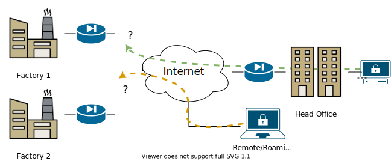
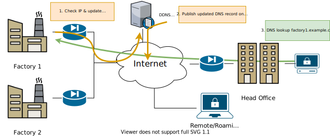

# In-a-Dyn DDNS

## What is it?

- DDNS = Dynamic DNS  
  Updated automatically
  
- DDNS Provider = ISP or Registrar  
  Usually an Internet Service Provider
  
- DNS Name for an IP address  
  Most ISP customers have a DHCP or PPPoE/PPPoA address

- In-a-Dyn is a DDNS client -- sync your IP with your name

## Requirements

- ISPs are everywhere, where their customers are.  
  Many are also DDNS providers.

- A DDNS client should
  - support as many providers as possible
  - support updating more than one DNS entry, or
  - even multiple DDNS providers from one IP (DNS backup)

- In-a-Dyn:  
  → supports over 30 different providers  
  → supports both IPv4 and IPv6  
  → supports HTTPS w/ OpenSSL or GnuTLS  

## How does it work?

> A good DDNS client actively tracks changes to your *external* IP address,  
> and automatically updates your DDNS provider(s).

 - Most DDNS providers have a "check ip" server, e.g. <https://checkip.dyndns.com>

        jocke@fra:~$ curl checkip.dyndns.com
        <html><head><title>Current IP Check</title></head><body>Current IP Address: 138.68.65.229</body></html>

 - Update the DNS entry, usually with a HTTP GET request.  Can be done
   manually, of course, but most users prefer an automatic service do
   this for them

## Common Use-Case

> How do we set up a VPN to each site when ISPs can change address of
> our sites at any time?  Note, even if you swap it around and let the
> sites connect to your head office, it may also have a DHCP address.

{ width=75% }

- User has multiple connected sites
- Each site has a DHCP address

## Solution

{ width=75% }

1. Sites connect to DDNS provider update their DNS entry
2. DDNS provider publishes update DNS record to Internet
3. Connection (VPN usually) can be initiated from either end  
   → Usually on-demand service VPNs are used  
   → Works with Roadwarriors too

## The Protocol

> Wow, Dyn.com gets lots of customers, let's copy them!

- Simple idea, invented by Dyn.com:
  1. Use HTTP GET to get IP address
  2. Use HTTP GET to update the DNS

- Every other ISP/DNS provider copied protocol:
  - FreeDNS (really good, free alternative!)
  - Loopia
  - D.U.I.A.
  - ...
  
- Some providers today use HTTP Post to update
  - Cloudflare
  - Yandex
  - DNSPod

## Problems

- Sounds simple, let's wrap curl in a shell script!

- Well ... scripts work for many use-cases but there are things the
  DDNS providers don’t want you to know

- Many DDNS providers **block your account**
  - for "too frequent" updates -- their discretion :-(
  - updating without actual IP change -- no curl cron jobs :-(

- No Internet, we’ve all been there, but what if:
  - the provider doesn’t respond 
  - the provider responds weirdly
  - need validation + retry mechanisms + logging

## Testing

{ width=40% style="fload:right," }

- How to test this?
  - HTTPS certificates
  - IPv4 vs IPv6
  - Providers blocking too frequent updates
  - etc.
- In-a-Dyn:  
  → has a built-in .conf file validator  
  → supports custom providers  
  → automatic testing of Dyn.com and FreeDNS 

# Questions?

