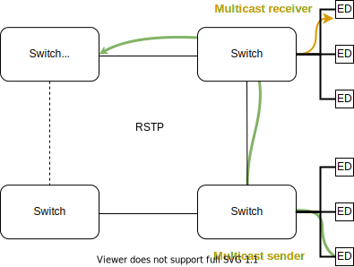

# Motivation

## Why Multicast?

- Broadcast &#129324;
- Multiple unicast &#128556;
- Multicast &#128578;

## Broadcast

- Broadcast is bad &#129324;
- What can be done?

## Multiple unicast

- Wastes bandwidth
- Doesn't scale with users

## Multicast

- Seems perfect! &#128578;
- Unregulated multicast is broadcast &#129324;
- Multicast is hard ...

# IGMP/MLD Snooping

## LAN Solution

- Control protocol between multicast router and end-devices
  - IGMP -- Internet Group Messaging Protocol (IPv4)
  - MLD -- Multicast Listener Discovery (IPv6)
- IGMP/MLD snooping is used by layer-2 switches on a LAN
- Switch snoops IGMP/MLD control traffic to reduce flooding

## Waht?

- Reduces the broadcast effect of multicast on a LAN
- Subscription based protocol -- think: newpapers
- A group is the IP destination address for multicast
- A listener (or receiver) *subscribes* to a multicast group
- Only members/subscriber of a group receive the multicast data

- **Other commonly used terminlogy:**
  - multicast sink (receiver)
  - multicast source, or sender/origin(ator)
  - join or leave a group (subscribe and unsubscribe)
  - group membership query -- from router/querier
  - membership report/reply -- from end-device

## How?

- Many LANs don't have a multicast router
- Most switches can act as a multicast querier instead
- Query reaches all devices on the LAN
- End-devices reply if they want a multicast group
- Replies alway reach the elected querier
- Queries and replies seen by switches along the path

> "Q: Anyone want multicast?"

## Multicast Flow (1/2)

- Multicast data is always forwarded towards the elected querier
- Snooping switches can either
  - flood "unknown" multicast, or
  - prune "unknown" multicast

## Multicast Flow (2/2)

- As soon as querier, or snooping switch sees reply
  - Multicast data is forwarded on that port
  - First reply to a group → multicast becomes "known"
- If multicast stream already passes switch, forwarded immediately

# Important Details

## RFC 1112

- Reserved IPv4 multicast: 224.0.0.0 -- 239.255.255.255
- Reserved IPv4 MAC multicast prefix: 01:00:5e:xx:xx:xx (23 bits)
- MAC address overlap:  
  → 225.1.2.3 => 01:00:5e:01:02:03  
  → 226.1.2.3 => 01:00:5e:01:02:03  
  → 239.1.2.3 => 01:00:5e:01:02:03
- Most layer-2 switches can only filter multicast on MAC address level
- Set up an IP Multicast Address Plan for your site/org!

## Unkown vs Known Multicast

- **Unknown:** multicast with no subscribers → forward to querier
  - Must always be flooded towards the querier/router
  - What if it's only unknown in one VLAN on a VLAN trunk port?
- **Known:** at least one subscriber
  - Must also be flooded towards the querier/router
  - When the last subscriber leaves the group → unknown multicast

# Multicast Routing

## Basic Concepts

- Multicast router daemon
  - Opens kernel multicast routing socket
  - Manipulates kernel multicast routing table
  - Examples: SMCRoute, mrouted, pimd, pimd-dense, pim6sd
- Kernel does the actual routing (forwarding): lan1 → lan2
- Kernel cannot do multicast routing without a router daemon
- (S,G) routes → (source, group)
- (*,G) routes → (anysrc, group)
- Active Linux multicast routes (currently) must be (S,G)
- Kernel routes limited to MAX 32 interfaces

## mrouted

- First dynamic multicast routing daemon
- Has RIP built-in (yes, really)
- Only IPv4
- Built-in IGMP v1/v2/v3 querier support
- Works out-of-the-box, no config needed
- Devices with maaaany interfaces need config ...

        no phyint
		phyint lan1 enable
		phyint lan2 enable

## SMCRoute

- Static routing daemon, with some dynamics
- *No IGMP/MLD querier function*
- Needs configuration to do anything at all

        # cat /etc/smcroute.conf
        mroute from lan1 source 192.168.1.42 group 225.1.2.3 to lan2
        mroute from lan1 group 225.3.2.1 to lan2

        # smcroutectl help
               <----------- INBOUND ------------>  <--- OUTBOUND ---->
        add    IFNAME [SOURCE-IP] MULTICAST-GROUP  IFNAME [IFNAME ...]
        remove IFNAME [SOURCE-IP] MULTICAST-GROUP
     
        join   IFNAME [SOURCE-IP] MULTICAST-GROUP
        leave  IFNAME [SOURCE-IP] MULTICAST-GROUP
    
        show   [groups|routes]

- Listens for new inbound multicast streams
- Maps multicast streams to (*,G) routes
- Creates a dynamic (S,G) Linux route

## How to Debug

1. Verify multicast group of inbound traffic, e.g. tcpdump
2. Check TTL -- hands-down most common problem, too small TTL
3. Check kernel and routing daemon setup

        # bridge mdb show
        # cat /proc/net/igmp
        # ip maddr
        
        # cat /proc/net/ip_mr_vif
        # cat /proc/net/ip_mr_cache
        # ip mroute
   	    
        # mroutectl help
        # smcroutectl help

# Questions?

# Extra material

# Devices w/ built-in Switch

## Intro

- Multicast routing on a device w/ switchcore can be challenging
- Limitations in kernel switchdev dsa driver:
  - does not support offloading of multicast routes
  - has some remaining issues with multicast router ports
- Multicast routing with SMCRoute needs workaround:
  - SMCRoute is not an IGMP/MLD quierier
  - Cheat by using `mgroup IFNAME GROUP` to allow group to reach CPU
  - By joining group on the inbound interface we can route it

## Multicast Routing (1/3)

## Multicast Routing (2/3)

## Multicast Routing (3/3)

