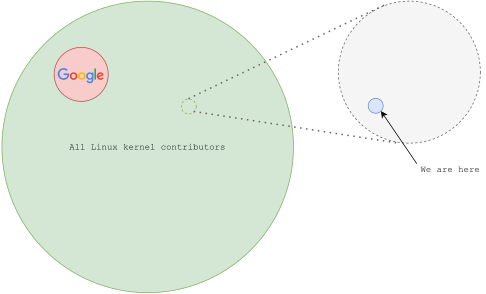
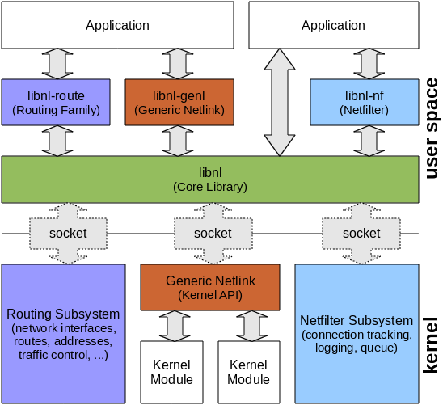
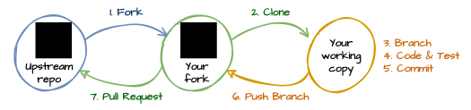

## Agenda

 - Why?
 - What?
 - How?
 - Email Clients
 - Examples

---

## Terminology & Overview

  - Original FLOSS package: *upstream*, *vanilla*, *mainline*
  - Modified work (internal/external): *downstream*, *fork*
  - FLOSS/FOSS/OSS: *Free/Libre Open Source Software*
  - Licenses guarantee freedom of use and responsibilities of parties
    - GNU GPL/LGPL: GNU (Library) General Public License: v2 or v3 -- we try to avoid v3
    - Apache License: Be aware of *license incompatibilities* with GPL!
    - BSD/MIT/X11/ISC: Simpler disclaimer type licenses
  - Some licenses *require*, all projects appreciate, publishing changes
  - *Upstreaming*: the act of publishing changes to an upstream project


# Why?

## If you can't beat 'em -- join 'em!


:::::::::::::: {.columns}
::: {.column width="50%"}



:::
::: {.column width="50%"}

  - [Google forked the Linux kernel](http://www.kroah.com/log/linux/android-kernel-problems.html) (Android)
    - They later decided it was not worth the trouble and
      worked out a compromise with the upstream maintainers
  - Google is a big company
  - This company is tiny in comparison -- so smol!
    - Can't afford to be a fork

:::
::::::::::::::

---

## Reasons for Upstreaming

  - Costly to maintain local changes to FLOSS in-house over time
  - Delays FLOSS package upgrades:
    - Critical customer releases get delayed
    - CVEs go unfixed for long periods of time
    - Projects start backporting new upstream features
    - Random instability issues -- bad backports
    - Complexity increases further ...
  - Delays Company New Product Releases
    - Stuck on older kernel -- hard to upgrade
    - Need new kernel for new SoC support
    - Extremely hard or costly to backport to old kernel
  - Most in-house patches are *not core business*
    - Integration changes, e.g., build system, logging, ...
    - Backported fixes/features
    - In-house fixes and even new features

---

## Reasons for NOT Upstreaming

  - "It's a complicated upstreaming process, they use ... a *mailing list*?"
  - "It's only some small patches ..."
  - "It's only a Coverity fix ..."
  - "Takes too long ..."
  - "We'll do it later ..."
  - "Why should we help our competition?"

---

## Actual Reasons

  - Not in checklist for project's *Definition of Done*
  - Mental block with devs:
    - "I'm too embarrassed to tell my manager I don't know how to ..."
    - "Surely nobody's interested in our patches, they're not even that good ..."
  - Projects have due dates:
    - Upstreaming is a line activity
    - No time reserved for devs
  - Unclear if it's allowed -- *everything* classified as
    - ... intellectual property
    - ... business critical
  - Weak (or no) line organization
  - Perceived cost

---

## Benefits of Upstreaming

  - Reduced maintenance overhead
  - Easier package upgrades
  - Increased stability
  - Interoperability
  - Investment = Cost savings
  - Free audit by experienced developers!
    - Great feedback improves our developers
  - Free future bug fixes, performance improvements, testing, etc.
  - Over time, builds a good reputation for the company
    - Great PR with little goodwill
    - Attracts other great developers ... hard to find otherwise
    - Easier to get upstream support and attention in future
  - Empowering developer's increases engagement with the company

::: notes

**Stability:** remember when projects started backporting stuff -- badly?

**Interop:** end-customer often wants or needs to use multiple vendors.
  Not sharing changes with competition can lead to interop issues.

:::

# What?

---

## What Should be Upstreamed?

  - Possibly huge backlog of patched packages
  - Prioritize!
  - Top 5 most important FLOSS packages
  - Top 5 most important/painful patches in each package
  - Lather, rinse, repeat ...

---

## What Should NOT be Upstreamed?

  - `integration.patch`
    - Odd build fixes for internal build system
    - Other integration changes required for our end-product
  - Disabling of package syslog messages
  - Changes to package identity:
    - Hide exact package/version from port scanners and log skimmers
    - Logs which can be sent as clear text over the wire
  - Other Company specific patches
    - Performance optimizations, e.g., moving tasks from  
      a power-save work queue to a high-priority one

---

## Big No-Nos

  - HTML email
  - Code dumps:
    - Complete source tree dumped on GitHub or ZIP file on FTP
    - HTML email to mailing list pointing to dump URL
    - "Hey, you may want this ... kthx bye!"  
      → Need to stick around to follow-up and answer feedback
  - Email disclaimers; *"message contains CONFIDENTIAL information"*
    - Usually added indiscriminately by Company IT dept. to all email
    - Ask IT or local manager to disable
    - Use another email provider (Gmail example later)
  - Asserting "your right" or "this must be fixed" in forums/mailing lists
    - Company *did not pay* to use the FLOSS package
    - Instead -- *be humble and polite*
    - The FLOSS package's license clearly defines rights & responsibilities

# How?

---

## Who?

> Maybe we need to start with the obvious question --  
> who wants to participate in upstreaming?

  - Not all devs may want to work with upstreaming due to
    - ... privacy issues -- e.g. protected identity for self or family members
    - ... personal preferences -- association with Company outside work
  - GDPR, right to be forgotten -- how should Company handle this?
  - Company may end up needing an upstreaming team just because of this ...
  - Even more obvious perhaps, who does the company trust  
    to represent it in the wider FLOSS Community?

## Taking Inventory

> First-timers should select a *simple one* to start with  
> rather than the ones most important to Company

  - What do we have?
  - *Prioritize*, as mentioned previously
  - Which ones are *most painful to port* when upgrading?
  - Classify:
    - Integration (never upstream)
    - **Too specific** to Company -- discuss; can it be generalized?
    - Candidate -- add to backlog
  - Huge changes may need to be broken down into *multiple patch series*

---

## Auditing Candidates

  - Internally in team first
  - Be tough on each other, it's just code
    - Does it provide **value to community**, is it general enough?
    - Is it applicable to the **latest upstream** version?
    - Does it perform sufficient **error handling**?
    - Can we supply a test-case or at least use-case?
  - Clean up **coding style** to match project's style, or at least surrounding code
  - **Rebase** on the latest upstream version, or master/main branch
  - Patches as **logical changes**, easier to review, required when **bisecting**:
    - Add feature X
    - Use feature X
    - Test case for feature X
    - Offloading support for feature X

## Signing Off

  - Developer Certificate of Origin (DCO) -- a **legal statement**
    - *Signed-off-by:* "I sign off on this, attesting to origin of change ..."
    - *Reviewed-by:* "Reviewed by me, attesting to technical validity and readiness ..."
    - etc.
  - *Signed-off-by* is the only applicable tag when submitting changes upstream
    - It is expected that you have (reviewed and) tested changes before sending
  - Initiated by Linux kernel community
  - Used by many other projects today
  - Support for adding/highlighting/extracting in many editors and other tools
  - Can also be used internally by orgs, simplifying quality review processes  
    -- "I sign off on this, attesting proper procedure/process has been followed ..."

  <https://www.kernel.org/doc/html/latest/process/submitting-patches.html#sign-your-work-the-developer-s-certificate-of-origin>

---

## Submitting Upstream

  - Learn about project, its people and guidelines
    - Where is upstream?
    - Is the GitHub project only a mirror?
    - Do they use mailing list or pull request?
    - Check if project uses DCO
  - Addressing the Right People
    - Is it the proper sub-project or mailing-list?
    - `To:` and `Cc:` of the correct people
  - Testing the waters `--rfc`, or **ready for mainline**?
  - Setting up Your Email Client (MUA)
  - Add email header (see `~/.gitconfig` later):
    - `Organization: Company Inc`
    - Credits Company as sponsor of the work
    - Used by maintainers when publishing per org. stats  
      → This in turn can be used by Company for brand labeling
    - Examples in upcoming slides
  - Disable email (html) footers/company confidentiality disclaimers

---

## Etiquette

  - **Plain text** is usually preferred
  - Avoid top-posting, use quoted-lines instead <https://en.wikipedia.org/wiki/Posting_style>
  - Remember, always **be polite**!  *(Expect different cultures, Swedes can be too direct)*
  - Many FLOSS projects have a formal *Code of Conduct*, see e.g.,
    <https://contributor-covenant.org>
  - **What does it do?** Present your idea or problem in plain words in the cover letter  
    → you can assume other's on the mailing list know how the program/subsystem works
  - When applicable; avoid vendor-specific terminology, use IEEE/IETF
  - New standards based features:
    - Explain how it relates to the standard
    - How it applies to the program/subsystem
  - There may be many more use-cases for your new feature/setting
  - Be prepared to **rework patch to generalize even further** → this is a good thing™
  - Don't send reminders, at least not too soon!
    - Maintainers are likely busy with other things, also they don't who you are
    - *Help out* instead to do Reviewed-by on other's patches -- build cred & learn
    - At least two weeks before sending reminder to mailing-list/pull-request/IRC
  - Always **reply to feedback!** *(Using Reply-All, not private replies ...)*
    - Ask questions if you don't understand what something means
    - Even if you understand and plan to address feedback, say so!
  - Pull Request Etiquette: <https://gist.github.com/mikepea/863f63d6e37281e329f8>

---

## Linux


:::::::::::::: {.columns}
::: {.column width="70%"}

  - Mailing list based -- <https://lore.kernel.org/>
  - Anyone can read (with git) and send to lists
  - <https://www.kernel.org/doc/html/latest/process/submitting-patches.html>
  - Huge, divided in subsystems with subsystem maintainers
  - Follows kernel release cycle, some subsystems closed in periods
  - DCO -- uses `Signed-off-by`, `Reviewed-by`, ... tags
  - <https://www.kernel.org/doc/html/latest/process/>
  - Lots to keep in mind, but also lots of great tooling available
    - `scripts/checkpatch.pl` detects most style issues
    - `scripts/get_maintainer.pl` figures out who to send patches to
    - `make C=1` will run the static code analyzer (sparse)
    - Be lazy, automate as much as possible
      - An example: [lore-up](https://github.com/wkz/bin/blob/master/lore-up)
      - Find what works for you!

> <https://www.kernel.org>
:::
::: {.column width="30%"}

{ width=75% }

:::
::::::::::::::

---

## Buildroot
:::::::::::::: {.columns}
::: {.column width="70%"}

  - Mailing list based -- <https://lore.kernel.org/>
  - Anyone can read (with git) and send to lists
  - Very active <https://patchwork.ozlabs.org/project/buildroot/>
  - DCO -- uses `Signed-off-by`, `Reviewed-by`, ... tags
  - Make sure to follow naming conventions and script style
  - If it's not in the [Buildroot Manual][], check other major
    packages: Linux, BusyBox

> <https://buildroot.org>
:::
::: {.column width="30%"}

{ width=75% }

:::
::::::::::::::

[Buildroot Manual]: https://buildroot.org/downloads/manual/manual.html

---

## Buildroot Checklist (1/2)

1. Make your changes on an up-to-date branch from Buildroot master

        $ git checkout -b package/foo
        $ git fetch --all --tags
        $ git rebase origin/master

2. Use *logical commits*; upgrade package as one, changing/extending
   behavior as another, etc.

3. Use commit messages to record *why* changes are made.  First line is
   a summary referencing the sub-system, followed by an empty line and
   the message body, and concluded by your sign-off
   
        package/foo: bump version to v1.2.3

        Signed-off-by: Your Name <your.name@example.com>

4.  Verify formatting of package files; .in, .mk, etc.

        $ ./utils/check-package package/foo/*

5. Test your package/change with a set of cross-compilation toolchains

        $ ./utils/test-pkg -c foo.config -p foo

   The `foo.config` menuconfig snippet enabling `BR2_PACKAGE_FOO=y` and deps.

::: notes

> Applies to many other mailing-list based projects as well

:::


## Buildroot Checklist (2/2)

6. Format your patches, with `--cover-letter` for patch sets

        $ git format-patch --cover-letter -M -n -s -o mail origin/master

   Remember to **edit the cover letter** --- it serves as an
   introduction and explains the reasoning behind your changes.  Focus
   on *the why, not the how,* the patches have separate commit messages

7. Figure out DEVELOPERS to Cc in your correspondence to the mailing list

        $ ./utils/get-developers mail/*
        git send-email --to buildroot@buildroot.org --cc foo@example.com

8. At the very least, the script should output

        $ git send-email --to buildroot@buildroot.org
        
9. Append `mail/*` to send.  You and others in Signed-off-by, Reviewed-by: are Cc:ed by default

        $ git send-email --to buildroot@buildroot.org --cc foo@example.com mail/*
        
> <https://troglobit.com/post/2022-01-04-buildroot-development-checklist/>

---

## BusyBox

:::::::::::::: {.columns}
::: {.column width="70%"}

  - Mailing list based -- <http://lists.busybox.net/mailman/listinfo/busybox>
  - Mailing list must be subscribed to send to
  - Maintained by Denys Vlasenko
  - DCO -- uses `Signed-off-by`, `Reviewed-by`, ... tags

> <https://busybox.net>
:::
::: {.column width="30%"}

{ width=75% }

:::
::::::::::::::

---

## libnl

:::::::::::::: {.columns}
::: {.column width="60%"}

  - GitHub based -- <https://github.com/thom311/libnl>
  - Not very active, can be slow to respond
  - Uses Pull Requests and Issues

> <https://www.infradead.org/~tgr/libnl/>

:::
::: {.column width="40%"}

{ width=90% }

:::
::::::::::::::

---

## GitHub Pull Request Workflow

{ width=50% }

> <https://www.youtube.com/watch?v=rgbCcBNZcdQ>

  - Requires a GitHub account
  - Company currently does not require corporate accounts
  - Preferably join the Company org. on GitHub
  - Preferably fork project to the Company org.
  - Checklist: <https://gist.github.com/Chaser324/ce0505fbed06b947d962>
  - Consider Pull Request Description == cover letter

# Email Clients

---

## General

  - Avoid HTML email
  - Disable email footers
  - Project-specific guidelines
  - Use `git format-patch` to create patch emails from commits
    - Remember `--cover-letter` when there's 2+ commits
  - Use `git send-email` to send patches
    - Need `git-email` package on Debian/Ubuntu/Mint
  - Use your email client to reply and do audits
  - Use `git format-patch -vN` for, e.g., `v2` of a patch or `--rfc`
  - Include any `Reviewed-by:` tags in follow-up patches
    - However, not if you've changed substantial parts of patch

> <https://www.kernel.org/doc/html/latest/process/email-clients.html>

::: notes

Debian/Ubuntu/Mint users will need to install the optional  
`git-email` package to get full send-email functionality.

:::

## Google Gmail

  - Many people have an account
  - Easy to add "another" account: `yourusername+oss@gmail.com`
  - Doesn't add any obnoxious corporate footer
  - Your contributions are yours:
    - Remember attribution to Company previously
  - However, **avoid the web client:**
    - Changes tabs to spaces
    - Wraps text (patch text) unconditionally
    - Base64 encodes messages with non US ASCII characters: åäö
  - Instead, **use with external client**:
    - Get [application specific password](https://myaccount.google.com/apppasswords)
    - Enable [IMAP for fetching email](https://mail.google.com/mail/u/0/#settings/fwdandpop)

---

## ~/.gitconfig using Gmail as SMTP server

```
[user]
    name           = YOUR NAME
    email          = yourusername+oss@gmail.com
[format]
    headers        = "Organization: Company Inc\n"
    signoff        = true
[sendemail]
    chainreplyto   = false
    smtpserver     = smtp.gmail.com
    smtpuser       = yourusername@gmail.com
    smtpencryption = tls
    smtpserverport = 587
    smtpPass       = yourapplicationspecificpassword
    aliasesfile    = ~/.config/mutt/aliases
    aliasfiletype  = mutt
[sendemail.netdev]
    to             = "davem@davemloft.net, kuba@kernel.org"
    cc             = "netdev@vger.kernel.org"
    cccmd          = "./scripts/get_maintainer.pl --norolestats"

# You can also use "alias-foo" in to= and cc=, expands from ~/.config/mutt/aliases
# git send-email --identity netdev mail/*
```

## Text Based Email Clients

### notmuch mail

  - Command line client
  - SUPER QUICK indexing with Xapian
  - Integrates well with MUAs, e.g. Emacs

> <https://www.notmuchmail.org/>

→ <https://troglobit.com/post/2021-05-11-emacs-gmail-and-lore-mailing-lists/>  
→ <https://bostonenginerd.com/posts/notmuch-of-a-mail-setup-part-2-notmuch-and-emacs/>


### Alpine

 - Config → Sending Preferences:
   - Do Not Send Flowed Text: `enabled`
   - Strip Whitespace Before Sending: `disabled`

---

### Mutt

```
# .muttrc -- remember to chmod 0600 due to password
set editor="vi"
set imap_user = 'yourusername@gmail.com'
set imap_pass = 'yourapplicationspecificpassword'
set spoolfile = imaps://imap.gmail.com/INBOX
set folder = imaps://imap.gmail.com/
set record="imaps://imap.gmail.com/[Gmail]/Sent Mail"
set postponed="imaps://imap.gmail.com/[Gmail]/Drafts"
set mbox="imaps://imap.gmail.com/[Gmail]/All Mail"
set smtp_url = "smtp://username@smtp.gmail.com:587/"
set smtp_pass = $imap_pass
set ssl_force_tls = yes
set editor = `echo \$EDITOR`
set edit_headers = yes
set charset = UTF-8
unset use_domain
set realname = "YOUR NAME"
set from = "username+oss@gmail.com"
set use_from = yes
```

---

### Thunderbird

  - **Known to mangle text!**
  - In the advanced config editor, disable `format=flowed` & `wraplength`
  - Enable Plain Text view of message body
  - Enable UTF-8 character encoding

> Or ... use the External Editor option

### Evolution

  - Composing mail, select *Preformat* (Ctrl-7) or the toolbar
  - Use Insert → Text File… (Alt-N x) to insert the patch

You can also use variants of `diff` or `git show`:

    $ diff -Nru old.c new.c | xclip
    $ git show gHASH | xclip

select Preformat, then paste with the middle button.  

# Examples

---

### Demo mailing list in Emacs with notmuch

::: notes

  - Also show <https://lore.kernel.org> to relate to Message-id
  - Remind participants of previously mentioned HowTos with URLs

:::

---

### Demo of patchwork -- review states

---


### Demo git format-patch and generated files

::: notes

  - edit generated files and cover letter
  - show git send-email to internal mailing list

:::

---

## Pull Request on GitHub

### Tip

> GitHub can give contribution hints  
> if project has a `CONTRIBUTING.md`

### Changes requested

> <https://github.com/jleclanche/fireplace/pull/344>  
    → <https://stackoverflow.com/questions/36944055/fixing-a-bad-pull-request>

### A good pull request

> <https://www.youtube.com/watch?v=rgbCcBNZcdQ>

  - Use logical commits with clear commit messages
  - Follow coding style, DCO if used in project, etc.
  - Sound familiar?

---

## Mailing List

  - Qemu PPC power save:
    [v1](https://lore.kernel.org/linuxppc-dev/20220112112459.1033754-1-troglobit@gmail.com)
  - block2mtd label:
    [v1](https://lore.kernel.org/linux-mtd/20211005080359.170360-1-troglobit@gmail.com),
    [v2](https://lore.kernel.org/linux-mtd/20211008140835.476949-1-troglobit@gmail.com),
    [v3](https://lore.kernel.org/linux-mtd/20211009060955.552636-1-troglobit@gmail.com)
  - Link aggregation:
    [RFC](https://lore.kernel.org/netdev/20201027105117.23052-1-tobias@waldekranz.com),
    [v1](https://lore.kernel.org/netdev/20201119144508.29468-1-tobias@waldekranz.com),
    [v2](https://lore.kernel.org/netdev/20201130140610.4018-1-tobias@waldekranz.com),
    [v3](https://lore.kernel.org/netdev/20201202091356.24075-1-tobias@waldekranz.com),
    [v4](https://lore.kernel.org/netdev/20201216160056.27526-1-tobias@waldekranz.com),
    [v5](https://lore.kernel.org/netdev/20210113084255.22675-1-tobias@waldekranz.com)
  - Bridge forward offloading:
    [RFC](https://lore.kernel.org/netdev/20210426170411.1789186-1-tobias@waldekranz.com),
    [RFC v2](https://lore.kernel.org/netdev/20210703115705.1034112-1-vladimir.oltean@nxp.com),
    [RFC v3](https://lore.kernel.org/netdev/20210712152142.800651-1-vladimir.oltean@nxp.com),
    [v4](https://lore.kernel.org/netdev/20210718214434.3938850-1-vladimir.oltean@nxp.com),
    [v5](https://lore.kernel.org/netdev/20210722155542.2897921-1-vladimir.oltean@nxp.com)

# Fin

## References

- <https://bootlin.com/pub/conferences/2016/collab-summit/petazzoni-upstreaming-hw-support-in-linux-kernel-why-how.pdf>
- <https://www.ibrahimatlinux.com/uploads/6/3/9/7/6397792/03.pdf>
- <https://opensource.guide/how-to-contribute/>
- <https://www.slideshare.net/linaroorg/upstreaming-101-sfo17tr02>
- <https://www.slideshare.net/linaroorg/bud17tr03-upstreaming-201>
- <https://01.org/community/signed-process>

